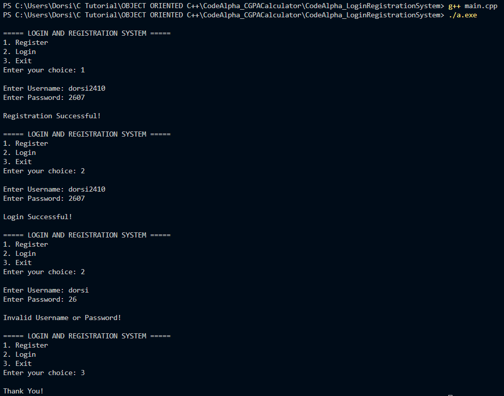

# CodeAlpha Login and Registration System
A simple C++ project developed as part of the CodeAlpha C++ Programming Internship.

## Features
* User Registration
* User Login Authentication
* Stores user information in a text file
* Verifies username and password
* Displays successful or failed login messages
* Menu-driven interface

## Technologies Used
* C++
* Visual Studio Code
* File Handling
* GCC Compiler

## Files Included
* main.cpp
* users.txt
* README.md

## How It Works
1. Select Register.
2. Enter username and password.
3. User details are saved in users.txt.
4. Select Login.
5. Enter username and password.
6. Program checks credentials and displays the result.

## Sample Output

## Author
Dorsi Khan

## Internship
CodeAlpha C++ Programming Internship
